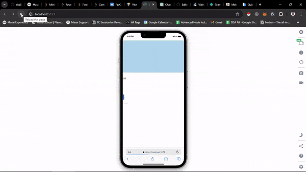

# React + Vite GuruCool Assignment
---
## Animations
* FadeIn
* SlideIn
* Rotation Animation

## Desktop Version

### Tablet

### Mobile

# Triggering point for animations

## FadeIn Animation
> When we refresh the page we can see the [social media] text is being faded in.

## SlideIn Animation
> Similar to FadeIn, When we refresh the page we can see the [List of social medias] box is being slided from left to right.

## Rotate Animation
> Rotate animation is triggered when we click on the button associated with each of the social media container

# Deployed Link
[Visit Here](https://resplendent-croquembouche-0f4d8e.netlify.app/)

